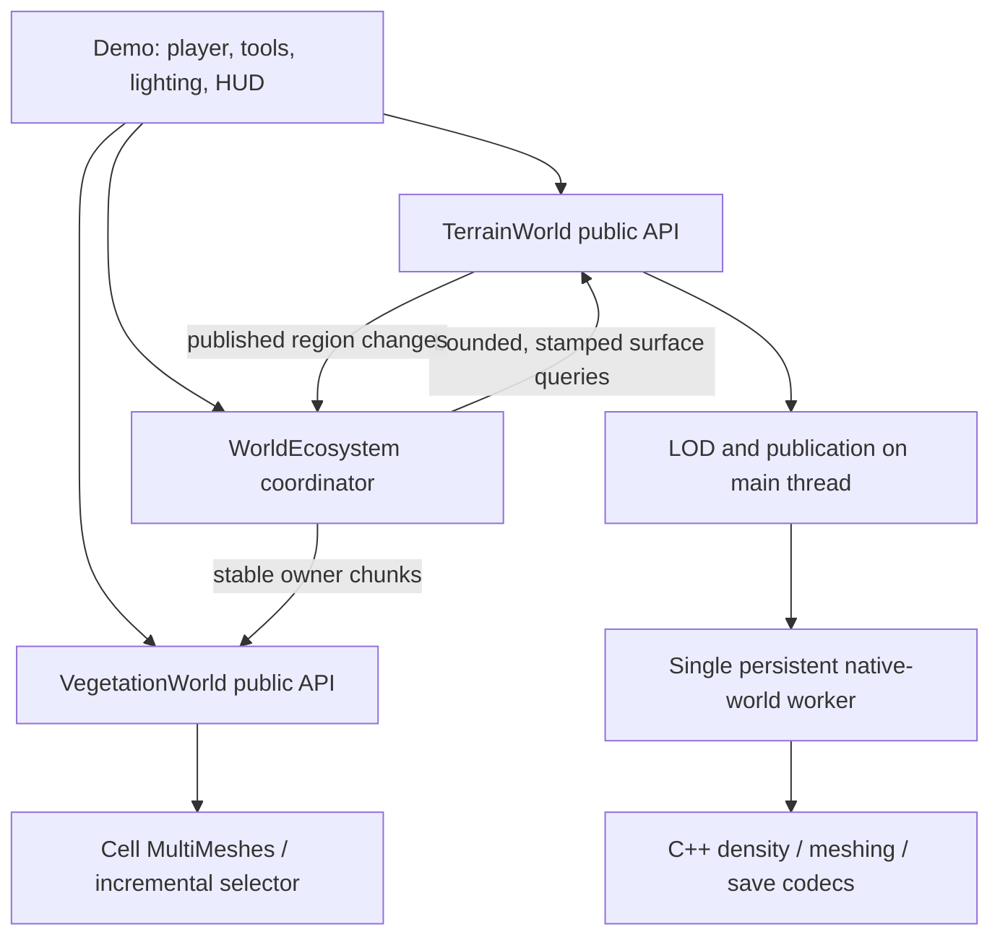

# Architecture and invariants

## Foundation reassessment — 2026-09-30

Status: architectural decision and implementation sequence, **not an implemented
replacement or a performance qualification**. The sections below this reassessment
describe the current runtime. Earlier experimental reports remain evidence, not
delivery milestones. This sequence supersedes continuing isolated mesher research.

### What the runtime audit established before this revision

- `terrain_backend.gd::_build` sends only 16/32 m columns through the optional
  brick path; larger visible patches still rebuild through the legacy mesher.
- `_invalidate` in `terrain_stream.gd` puts affected visible coarse patches in
  the edit transaction. Publication waits for its complete replacement set.
- Every changed edit sets `cache_valid=false` and clears `latest_packets`.
  Derived-cache identity follows the complete saved terrain payload, rather than
  the dependencies of an individual output. This is conservative correctness,
  but prevents reliable reuse of unaffected outputs across edits/saves.
- Baking already exists in `tools/bake_cache.cpp` and `base_cache`; the missing
  foundation is a complete bake/load/edit/reload lifecycle with local validity.
- The last integrated brick run failed five gates; travel edit-publication p95
  was 451.044 ms. Native geometry timings do not supersede this result.

Do not remove global invalidation until local dependency validation replaces it.
Do not make the publication test pass by acknowledging edits before matching
local visuals and collision are usable.

### Separate world truth, edit ownership, and presentation

The generator is a producer of versioned world data. Rendering is a consumer;
a render LOD patch must not determine the size of a canonical edit or transaction.

| Layer | Intended ownership and lifetime |
| --- | --- |
| World descriptor | Seed, generator/content versions, coordinate convention and material registry; immutable identity of a base world |
| Canonical regions | Generated base plus compacted edits and placed-object state; durable, spatially addressable, independently loadable |
| Reconstruction bricks | Small 3D edit owners with explicit density/normal halos; independently replaceable geometry and collision |
| Derived presentation | Near surfaces, distant aggregates, lighting and vegetation buffers; versioned disposable outputs, never world authority |
| Resident working set | Bounded subset selected for players, motion corridors and pending transactions; explicit byte reservations and eviction |

Use the existing 32 m brick work as an initial integration unit, not a universal
optimal size. Brick size, worst-case geometry and upload cost remain measured
parameters. Save regions, render batches and collision activation regions need
not have identical sizes. Do not create one scene node per voxel or force all
world systems into terrain density.

### Make baking and persistent reuse first-class

For the current finite world, support a resumable offline base-world bake with a
manifest and checked outputs. Measure its complete disk footprint and throughput
before making it a required distribution format. Full bake means disk coverage,
not loading every brick, collider or LOD into RAM. On-demand generation must
produce the same artifact format and remain available for missing regions.

Each artifact records its world/generator identity, spatial owner, representation
version and exact input dependencies. Dependencies include relevant neighbor
density pages; lighting has its own potentially larger dependency set. Local
content revisions/hashes, not a whole-world save hash, decide reuse. Parent LOD
artifacts depend on child content. Persist enough version information to reject
stale artifacts after restart, including edits in neighboring regions.

Write canonical changes durably through a recoverable transaction/checkpoint
mechanism; meshes are not saves. Publish cache artifacts atomically with integrity
checks. Corruption is a rebuildable cache miss. A full disk must not delete dirty
canonical data. Bound cache reads, writes, pending bytes and eviction, including
coordination with a bake process. Do not serialize the complete world per dig.

### Local interaction must have a local completion path

1. Admit a command against loaded authoritative data and available resources.
2. Apply its local canonical transaction and identify changed dependency owners.
3. Reconstruct and prepare only the required local visual/collision replacements.
4. Publish those together after epoch, dependency and coverage checks.
5. Refresh dependent distant aggregates and lighting under separate budgets.

Step 5 cannot block step 4, but that separation is conditional on correct coverage:
a stale parent cannot remain over a changed child, occlude its excavation, or
create a seam. Retain valid child coverage until a matching parent is ready.
Replacement cuts need a shared boundary contract. Existing legacy/candidate
boundaries fail that contract and must not be spliced together or hidden by skirts.

Use one compatible representation family for a baked region's near surfaces and
its derived coarse surfaces. Evaluate boundary-preserving aggregation through the
runtime integration, with explicit geometry and memory rejection gates. No new
meshing algorithm is selected or claimed necessary by this document. The current
candidate still has collision failures; it cannot be promoted merely because its
locality tests pass. Transvoxel remains on its separate experimental branch.

Prefetch editable surfaces and collision along movement corridors. A cold arrival
must expose its actual readiness delay; neither a warmed-only benchmark nor an
unreported movement restriction qualifies high-speed traversal. Bound how much
fine coverage dirty parents can pin; sustained edits must not grow residency forever.

### Shared runtime, distinct addon representations

Reuse stable spatial IDs, storage transactions, dependency tracking, scheduling,
resource accounting and publication rules across addons. Keep their data distinct:
terrain fields; building blocks/shapes and static-model instances; vegetation
owners and instance batches; water definitions/derived occupancy; entity state.
Vegetation invalidation must query actual changed support regions and preserve
unaffected instances, rather than clear a terrain render tile. Static/dormant
content must not automatically become active physics or per-frame simulation.

Native C++ owns these performance-sensitive services through the existing
GDExtension toolchain. Godot scripts retain configuration, UI and mod hooks.
Server authority, interest management and multiplayer replication remain future
integration work; local region architecture alone proves no player-count capacity.

### Deliver one integrated replacement before extending scope

The next implementation slice must use the existing backend, stream and public
edit API: bake a real failing coarse region, load it, excavate across ownership
boundaries, update local collision, travel away, save/restart and return using
valid persisted results. Reuse the original mining/travel workload; do not create
another standalone mesher as the deliverable. Extend the same implementation to
world coverage after it survives this real lifecycle.

Acceptance requires all of the following, reported separately:

- Original fullscreen 1920x1080/full-scale workload at 1x, then 4x and 16x remote
  edit pressure. Existing p95 publication <=150 ms and frame p99 <=20 ms/no
  >50 ms stalls remain rejection ceilings, not certification of strict 60 FPS.
- Cold and warm traversal, plus save/restart/return. Show cache hits/misses,
  bytes read/written and actual rebuild counts. An unrelated edit must preserve
  unaffected artifact validity; a dependent edit must reject stale artifacts.
- Boundary/cave correctness, visible excavation, collision agreement and no
  loss of unrelated vegetation. Keep existing failure witnesses as regressions.
- Fixed local edits must not acquire reconstruction work proportional to world
  extent or remote edit history. Measure queue, capture, reconstruction, packing,
  collision preparation and publication separately within end-to-end latency.
- Repeated travel and sustained edits must plateau in resident/pending bytes,
  job backlog and retained fine coverage. Account for native and GPU resources
  as well as engine-reported memory; budgets cannot silently drop accepted edits.

Keep proven storage/recovery, snapshots, cancellation and publication components
where their contracts fit. Replace global cache validity, coarse-patch edit
ownership and blocking scheduling incrementally. Do not rewrite buildings,
vegetation and gameplay wholesale without evidence requiring it. Do not claim
this reassessment itself improves runtime performance.

## Current implementation

### First cache integration following the reassessment

The legacy reconstruction path now additionally looks up geometry by a native
SHA-256 content key, independent of the saved-world snapshot namespace. Inputs
include seed, surface style, requested patch/step, cave definitions, local page
contents and presence, simplifier neighboring-page masks, and ordered local and
neighboring blocks. The existing binary/codec signature separates incompatible
implementations. Page lookups cover the local dependency box, not the global
edited-page list. Full neighboring pages are conservative dependencies, so some
edits outside the exact surface support can still cause misses.

Reused geometry always refreshes sky visibility against the current world before
publication; this cache does not certify old lighting. Global invalidation remains
for the old snapshot-addressed shaded packets. Fresh native results and valid
snapshot packets may populate the new namespace; bundled base meshes do not
establish a new local content identity. Writes remain suppressed during active
input and subject to the existing disk cap. Snapshot/brick encoders do not use
this cache yet. It does not reduce the reconstruction size of a changed patch.

`tools/probe_terrain_publication.py --geometry-cache --godot PATH` exercises the
real backend, edits, disk cache and canonical save/restart. Its separate evidence
must not be presented as integrated mining latency or an endurance qualification.

Retained evidence: `evidence/terrain_geometry_content_cache/`. The 60 backend
checks pass, including deliberately stale checksum-valid visibility, remote
density edits, save/restart and nonempty near collision recipe equality. The
existing 120-check brick publication fixture also passes. Debug and release
extensions build against the pinned prebuilt SDK without rebuilding godot-cpp.

The post-change 136-edit fullscreen 1920x1080/full-scale run **still fails six
gates**, with zero runtime errors. Publication p95 is 203.204 ms compact,
203.226 ms expanding, 484.477 ms travel and 85.003 ms return. Frame p99 is
28.719/27.300/18.514/17.552 ms for those phases and 30.571 ms recovery. There are
no measured frames above 50 ms. These observations do not establish a speedup;
the earlier brick run failed five gates. This change establishes reuse semantics,
not a mining fix. Large changed patches still reconstruct in full, and cache
lookup/hash/visibility costs require further budgeting in the replacement path.

## Ownership

The native world and filesystem cache are owned by one worker. Only its cancellation token is accessed across threads. Scene nodes, textures, meshes, collisions, MultiMeshes and material uniforms are created/mutated on the main thread. Worker results are data packets. No second vegetation thread races terrain state.

The main thread validates epoch/tile stamps before installing terrain packets. Density edits prepare their whole affected set, then publish meshes and collision together. Lighting refreshes are separate background work. The ecosystem reacts after publication; pre-edit query results never repopulate a later terrain revision.

The Windows typed terrain binding has instance-owned cancellation and serializes world access per instance; cancellation remains lock-free. Its legacy Linux binary still uses process-global cancellation. The public facade continues enforcing one active scene world per process until cache paths and save-slot ownership support multiple live scene worlds. Independent native worlds are tested separately; see [terrain bridge validation](TERRAIN_NATIVE_VALIDATION.md).

## Backpressure and memory

| Domain | Bound / behavior |
| --- | --- |
| Worker jobs | 96 jobs; submission also stops at 128 queued jobs plus results |
| Surface placement | 64 positions maximum per API request; demo batches contain at most 36; two in flight |
| Forest residency | 169 coordinator cells by default; no accumulated visited-cell history |
| Forest roots | 16,384 hard admission limit; default candidate residency allows at most 6,084 before biome/slope filtering |
| Terrain cached mesh payload | 192 MiB / 512 tiles by default; active/required coverage protected |
| Pending derived packets | 64 MiB; replacement accounts for the existing packet before testing the cap |
| Derived disk cache | 512 MiB target; exceeding it stops new cache writes, not edits |
| Frame instrumentation | 64 pending draw records; 128 slow-edit records |
| Native density | Fixed world and native page-capacity checks inherited from TerrainRewrite |

Budgets are not total process/VRAM limits. GPU drivers, texture payloads, colliders, active mesh coverage, worker staging, native lighting caches and native edit pages consume additional memory. GPU resource creation is not preemptible. Initial source/proxy texture loading is synchronous and belongs to startup, not a streaming gameplay frame.

## Lifecycle

Start once, wait for terrain initialization, then wait separately for player-region collision readiness before enabling walking. Continue updating terrain focus. Surface sampling uses admission failure as backpressure and retries later. Reload clears dependent ownership and increments the terrain epoch. Shutdown disconnects frame callbacks, stops new processing, wakes/joins the worker, and releases staged/retired resources.

Vegetation IDs belong to an owner; replacement validates the complete set before removing the old set. Owner removal dirties only affected cells. Empty cells free their MultiMesh nodes. Explicit clear also clears the LOD event heap, avoiding retained stale selector records when there is no camera.

## Persistence and recovery

Canonical world state is saved to a temporary file, flushed and read back, then rotated with a backup. A corrupt snapshot disables overwrite. Failed multi-command native edits are not advertised as rollback-atomic and disable persistence. Derived cache checksums reject corrupted mesh packets. Terrain modification metadata is the authority for procedural tree suppression, so reload does not replant excavations.

External systems can listen to `region_changed` rather than reaching into worker state. Custom planting/removal persistence, multiple species, gameplay tree collisions and network authority are intentionally separate future systems.
