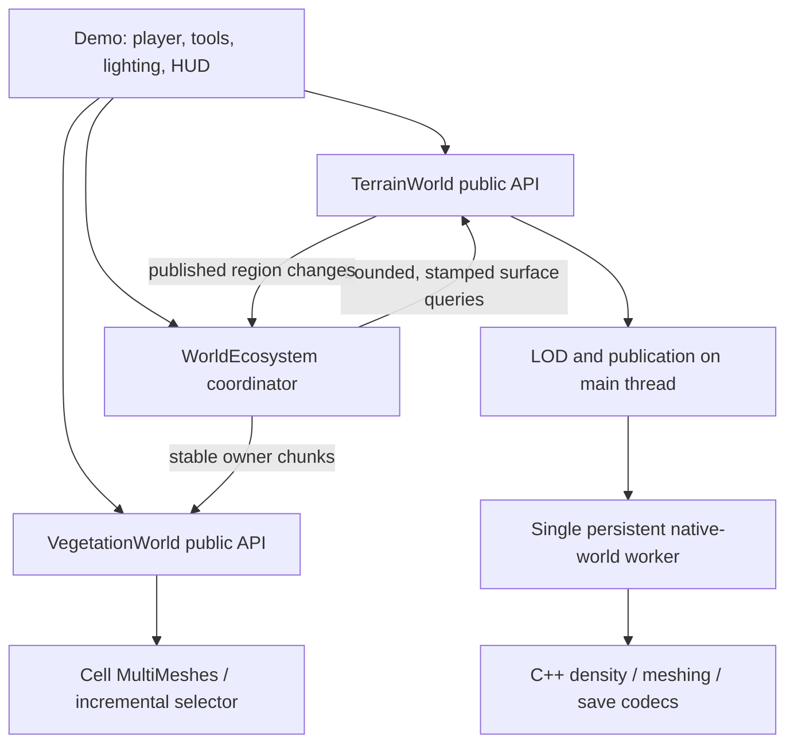

# Architecture and invariants

## Ownership

The native world and filesystem cache are owned by one worker. Only its cancellation token is accessed across threads. Scene nodes, textures, meshes, collisions, MultiMeshes and material uniforms are created/mutated on the main thread. Worker results are data packets. No second vegetation thread races terrain state.

The main thread validates epoch/tile stamps before installing terrain packets. Density edits prepare their whole affected set, then publish meshes and collision together. Lighting refreshes are separate background work. The ecosystem reacts after publication; pre-edit query results never repopulate a later terrain revision.

The terrain native ABI uses process-global cancellation. The public facade therefore enforces one active native world per process. This is an explicit current constraint, not an assumption that multiple worlds happen not to overlap.

## Backpressure and memory

| Domain | Bound / behavior |
| --- | --- |
| Worker jobs | 96 jobs; submission also stops at 128 queued jobs plus results |
| Surface placement | 64 positions maximum per API request; demo batches contain at most 36; two in flight |
| Forest residency | 169 coordinator cells by default; no accumulated visited-cell history |
| Forest roots | 16,384 hard admission limit; default candidate residency allows at most 6,084 before biome/slope filtering |
| Terrain cached mesh payload | 192 MiB / 512 tiles by default; active/required coverage protected |
| Pending derived packets | 64 MiB; replacement accounts for the existing packet before testing the cap |
| Derived disk cache | 512 MiB target; exceeding it stops new cache writes, not edits |
| Frame instrumentation | 64 pending draw records; 128 slow-edit records |
| Native density | Fixed world and native page-capacity checks inherited from TerrainRewrite |

Budgets are not total process/VRAM limits. GPU drivers, texture payloads, colliders, active mesh coverage, worker staging, native lighting caches and native edit pages consume additional memory. GPU resource creation is not preemptible. Initial source/proxy texture loading is synchronous and belongs to startup, not a streaming gameplay frame.

## Lifecycle

Start once, wait for terrain initialization, then wait separately for player-region collision readiness before enabling walking. Continue updating terrain focus. Surface sampling uses admission failure as backpressure and retries later. Reload clears dependent ownership and increments the terrain epoch. Shutdown disconnects frame callbacks, stops new processing, wakes/joins the worker, and releases staged/retired resources.

Vegetation IDs belong to an owner; replacement validates the complete set before removing the old set. Owner removal dirties only affected cells. Empty cells free their MultiMesh nodes. Explicit clear also clears the LOD event heap, avoiding retained stale selector records when there is no camera.

## Persistence and recovery

Canonical world state is saved to a temporary file, flushed and read back, then rotated with a backup. A corrupt snapshot disables overwrite. Failed multi-command native edits are not advertised as rollback-atomic and disable persistence. Derived cache checksums reject corrupted mesh packets. Terrain modification metadata is the authority for procedural tree suppression, so reload does not replant excavations.

External systems can listen to `region_changed` rather than reaching into worker state. Custom planting/removal persistence, multiple species, gameplay tree collisions and network authority are intentionally separate future systems.
